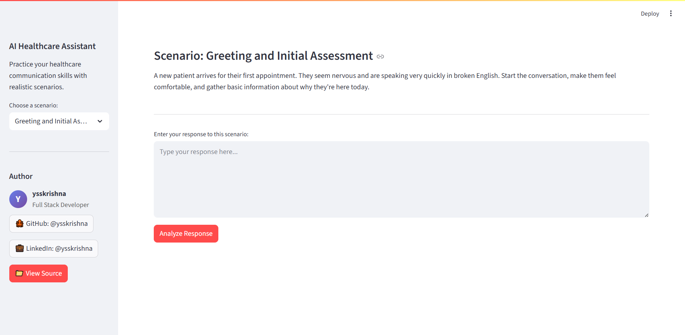
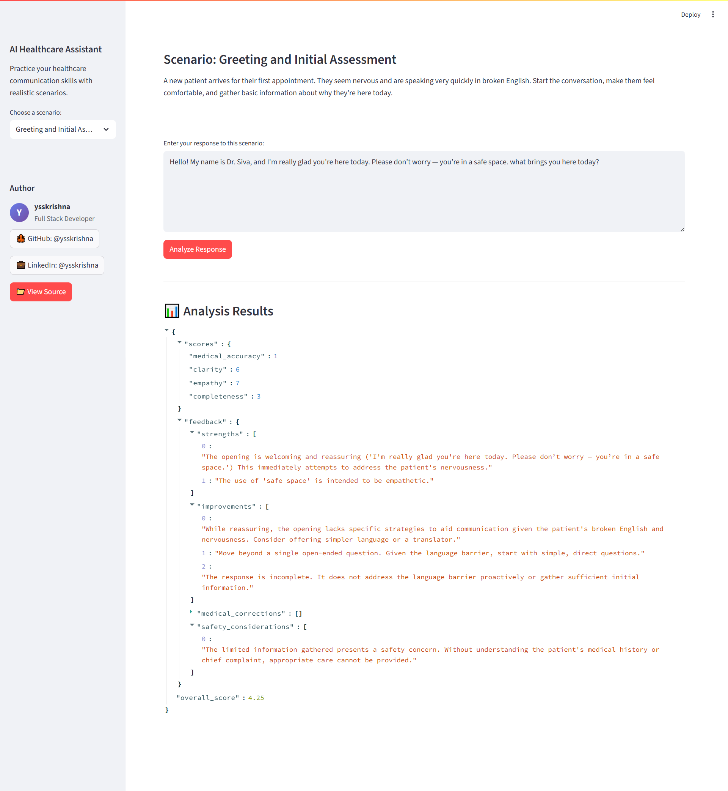

# AI Healthcare Assistant

[](https://www.python.org/downloads/)
[](https://streamlit.io/)
[](https://ai.google.dev/)
[](https://docs.astral.sh/uv/)
[](LICENSE)

An interactive web application that helps healthcare professionals practice their communication skills through realistic patient scenarios. Built with Streamlit and powered by Google's Generative AI, this tool provides instant feedback on medical communication responses.





## 🏥 Features

- **Realistic Healthcare Scenarios**: Practice with common patient interactions including:
  - Initial patient assessments
  - Procedure explanations
  - Discharge instructions
- **AI-Powered Analysis**: Get instant feedback on your responses across multiple dimensions:
  - Medical accuracy
  - Communication clarity
  - Empathy and patient care
  - Completeness of information
- **Interactive Web Interface**: Clean, intuitive Streamlit-based interface
- **Response Storage**: All interactions are saved for review and improvement tracking

## 🛠️ Technology Stack

- **Frontend**: Streamlit
- **AI Backend**: Google Generative AI (Gemini)
- **Package Management**: UV
- **Language**: Python 3.9+

## 📁 Project Structure

```
assessment/
├── ai/                    # AI analysis components
│   ├── analyzer.py       # Main analysis logic
│   ├── client.py         # Google AI client
│   ├── prompts.py        # AI prompts
│   └── utils.py          # Utility functions
├── core/                  # Core application logic
│   ├── config.py         # Configuration settings
│   └── scenarios.py      # Healthcare scenarios
├── media/                 # Media and sample files
│   └── sample_outputs/   # Example analysis outputs
│       └── *.json        # Sample result files
├── outputs/              # Generated analysis results
├── main.py               # Streamlit application entry point
├── pyproject.toml        # Project dependencies and configuration
├── uv.lock              # UV lock file for reproducible builds
└── README.md            # This file
```

## 📂 Sample Outputs

`media/sample_outputs/`: Contains example JSON files showing the structure and format of AI analysis results
- These files demonstrate the expected output format from the AI analysis
- Useful for understanding the analysis metrics and scoring system
- Can be used for testing and development purposes

## 🚀 Quick Start

### Prerequisites

- Python 3.9 or higher
- UV package manager (recommended) or pip

### Installation

1. **Clone the repository**
   ```bash
   git clone https://github.com/ysskrishna/ai-healthcare-assisstant.git
   cd ai-healthcare-assisstant
   ```

2. **Set up virtual environment and install dependencies**
   ```bash
   uv venv
   uv sync
   ```

3. **Activate the virtual environment**
   ```bash
   # On Windows
   .venv\Scripts\activate
   
   # On macOS/Linux
   source .venv/bin/activate
   ```

4. **Set up environment variables**
   
   Create a `.env` file by cloning `.env.sample` in the project root and add your Google AI API key:
   ```
   GOOGLE_API_KEY=your_google_ai_api_key_here
   ```

5. **Run the application**
   ```bash
   streamlit run main.py
   ```

The application will open in your default web browser at `http://localhost:8501`.

## 📋 Usage

1. **Select a Scenario**: Choose from the available healthcare scenarios in the sidebar
2. **Read the Description**: Understand the patient situation and your role
3. **Write Your Response**: Enter your communication response in the text area
4. **Get Analysis**: Click "Analyze Response" to receive AI-powered feedback
5. **Review Results**: See detailed scores and suggestions for improvement


## 📊 Analysis Metrics

The AI evaluates responses across four key dimensions:

- **Medical Accuracy**: Technical correctness and appropriateness
- **Clarity**: How well the information is communicated
- **Empathy**: Patient-centered care and emotional support
- **Completeness**: Coverage of necessary information

## 🤝 Contributing

1. Fork the repository
2. Create a feature branch (`git checkout -b feature/amazing-feature`)
3. Commit your changes (`git commit -m 'Add amazing feature'`)
4. Push to the branch (`git push origin feature/amazing-feature`)
5. Open a Pull Request

## 📝 License

This project is licensed under the MIT License - see the [LICENSE](LICENSE) file for details.

**Author:** [Siva Sai Krishna](https://github.com/ysskrishna)


